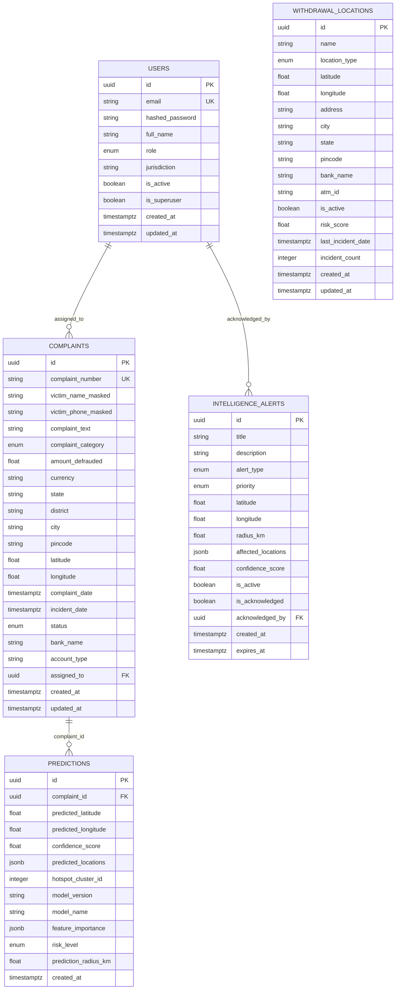

# Database Architecture & Data Models

CASHGUARD-AI utilizes **PostgreSQL 15** with the **PostGIS** extension for geospatial query handling, managed through SQLAlchemy 2.0 (AsyncIO) and Alembic migrations.

---

## 1. Entity-Relationship (ER) Diagram

---

## 2. Table Specifications

### 2.1 `users`
Stores administrative and field investigator credentials and access tiers.
- `id` (`UUID`, Primary Key, default: `uuid4()`)
- `email` (`VARCHAR`, Unique, Indexed, Not Null)
- `hashed_password` (`VARCHAR`, Bcrypt hash, Not Null)
- `full_name` (`VARCHAR`, Nullable)
- `role` (`ENUM('admin', 'analyst', 'viewer')`, default: `'viewer'`)
- `jurisdiction` (`VARCHAR`, Nullable — e.g. "Maharashtra", "Delhi")
- `is_active` (`BOOLEAN`, default: `true`)
- `is_superuser` (`BOOLEAN`, default: `false`)
- `created_at` / `updated_at` (`TIMESTAMPTZ`, default: `now()`)

### 2.2 `complaints`
Primary repository of reported cybercrime events.
- `id` (`UUID`, Primary Key)
- `complaint_number` (`VARCHAR`, Unique, Indexed, Not Null — e.g. `CYB/2024/10001`)
- `victim_name_masked` (`VARCHAR`, PII masked name)
- `victim_phone_masked` (`VARCHAR`, PII masked phone number)
- `complaint_text` (`TEXT`, Not Null)
- `complaint_category` (`ENUM('vishing', 'phishing', 'otp_fraud', 'atm_fraud', 'other')`)
- `amount_defrauded` (`FLOAT`, default: `0.0`)
- `currency` (`VARCHAR`, default: `'INR'`)
- `state`, `district`, `city`, `pincode` (`VARCHAR`)
- `latitude`, `longitude` (`FLOAT` coordinates)
- `complaint_date`, `incident_date` (`TIMESTAMPTZ`)
- `status` (`ENUM('pending', 'processing', 'predicted', 'resolved')`)
- `bank_name`, `account_type` (`VARCHAR`)
- `assigned_to` (`UUID`, Foreign Key -> `users.id`)
- `created_at`, `updated_at` (`TIMESTAMPTZ`)

### 2.3 `predictions`
Captures model inference outputs tied directly to a complaint.
- `id` (`UUID`, Primary Key)
- `complaint_id` (`UUID`, Foreign Key -> `complaints.id`, Cascade Delete)
- `predicted_latitude`, `predicted_longitude` (`FLOAT`, Not Null)
- `confidence_score` (`FLOAT` between 0.0 and 1.0)
- `predicted_locations` (`JSONB` array of Top-K targets: `[{"lat": ..., "lng": ..., "atm_name": ..., "confidence": ...}]`)
- `hotspot_cluster_id` (`INTEGER`, K-Means cluster assignment)
- `model_version` (`VARCHAR` — e.g. "1.0.0")
- `model_name` (`VARCHAR` — e.g. "xgboost_v1")
- `feature_importance` (`JSONB` SHAP attribution values)
- `risk_level` (`ENUM('low', 'medium', 'high', 'critical')`)
- `prediction_radius_km` (`FLOAT`, Geofence boundary)
- `created_at` (`TIMESTAMPTZ`)

### 2.4 `intelligence_alerts`
Actionable tactical and strategic alerts generated by automated anomaly and pattern detection.
- `id` (`UUID`, Primary Key)
- `title` (`VARCHAR`, Not Null)
- `description` (`TEXT`)
- `alert_type` (`ENUM('hotspot_detected', 'pattern_change', 'high_risk_location', 'temporal_spike')`)
- `priority` (`ENUM('low', 'medium', 'high', 'critical')`)
- `latitude`, `longitude`, `radius_km` (`FLOAT`)
- `affected_locations` (`JSONB` array of affected location UUIDs)
- `confidence_score` (`FLOAT`)
- `is_active` (`BOOLEAN`, default: `true`)
- `is_acknowledged` (`BOOLEAN`, default: `false`)
- `acknowledged_by` (`UUID`, Foreign Key -> `users.id`)
- `created_at`, `expires_at` (`TIMESTAMPTZ`)

### 2.5 `withdrawal_locations`
Catalog of physical cash endpoints (ATMs, bank branches, kiosks).
- `id` (`UUID`, Primary Key)
- `name` (`VARCHAR`, Not Null)
- `location_type` (`ENUM('ATM', 'bank_branch', 'payment_kiosk')`)
- `latitude`, `longitude` (`FLOAT`, Not Null)
- `address`, `city`, `state`, `pincode` (`VARCHAR`)
- `bank_name`, `atm_id` (`VARCHAR`)
- `is_active` (`BOOLEAN`, default: `true`)
- `risk_score` (`FLOAT`, default: `0.0`)
- `last_incident_date` (`TIMESTAMPTZ`)
- `incident_count` (`INTEGER`, default: `0`)

---

## 3. Database Initialisation & Seeding

- **Schema:** owned entirely by Alembic. Run `alembic upgrade head` (the
  docker-compose `migrate` service, or `kubernetes/migration-job.yaml`). The
  app no longer creates tables at startup. There is no PostGIS — see
  `docs/adr/0001-postgis.md`.
- **`backend/seed_db.py`**: after migrations, initializes standard accounts
  (`admin`, `analysts`, `viewer`), 39 distinct ATM locations across 13 major
  Indian metropolitan zones, 50 complaints, 30 predictions with SHAP metrics,
  and 15 intelligence alerts.
