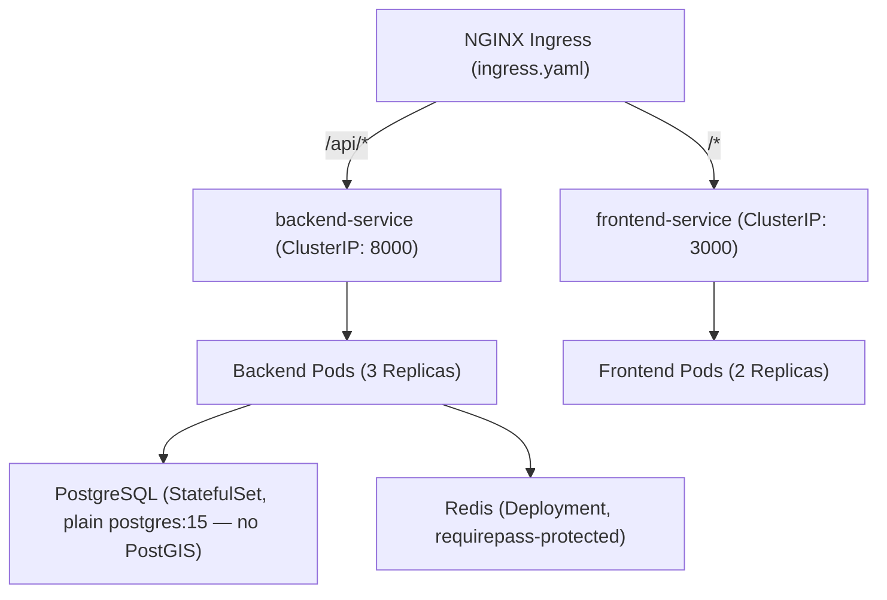

# DevOps, Containerization & Deployment Guide

This guide details how to build, deploy, scale, and maintain the **CASHGUARD-AI (CPAF)** system across local development, Docker Compose environments, and production Kubernetes clusters.

---

## 1. Containerization Architecture

The system is decoupled into isolated multi-stage container images:

### 1.1 Backend Dockerfile (`backend/Dockerfile`)
- **Base image**: `python:3.11-slim` (both the wheel-building stage and the runtime stage).
- **Security**: Creates an unprivileged user (UID `10001`) to run the Uvicorn server; `backend/.dockerignore` keeps `venv/`, tests, `.env*`, and caches out of the image.
- **spaCy model**: `en_core_web_sm` is downloaded at build time so `NLPExtractor` never hits the network at request time.
- **Port**: Exposes port `8000`.
- Note: PostGIS was evaluated and dropped — see `docs/adr/0001-postgis.md`. `postgres:15` (plain) is used everywhere, geospatial queries run in-process via a `sklearn.BallTree`, not PostGIS/GDAL.

### 1.2 Frontend Dockerfile (`frontend/Dockerfile`)
- **Base image**: Multi-stage `node:18-alpine` (deps → builder → runner), `output: 'standalone'` in `next.config.js`.
- **Build-time defaults**: `NEXT_PUBLIC_API_URL` / `NEXT_PUBLIC_WS_URL` are accepted as Docker build `ARG`s (default to `http://localhost:8000` / `ws://localhost:8000`) and inlined into the client bundle — this is what makes `docker compose up --build` work out of the box for local dev.
- **Runtime override**: `docker-entrypoint.sh` regenerates `public/env-config.js` from the container's *actual* runtime `NEXT_PUBLIC_API_URL`/`NEXT_PUBLIC_WS_URL` env vars on every start, and the client reads it via `window.__ENV__` (see `frontend/src/lib/runtime-env.ts`) in preference to the build-time-baked value. This is what makes the **same built image** deployable to any Kubernetes environment via a ConfigMap — no per-environment image rebuild needed. See §3 below.
- **Port**: Exposes port `3000`.

---

## 2. Docker Compose Deployment (`docker-compose.yml`)

The root `docker-compose.yml` is the source of truth for the local stack — see that file directly rather than a copy here, to avoid this doc drifting out of sync with it (as an earlier revision of this section did). In summary, it defines:

- `postgres` (plain `postgres:15`) — host port configurable via `POSTGRES_HOST_PORT` (default `5433`, to avoid clashing with a native Postgres install already on `5432`; containers always reach it at `postgres:5432` internally).
- `redis` (`redis:7-alpine`).
- `migrate` — one-shot `alembic upgrade head`; the **only** thing that touches the schema. `backend` waits for it to complete successfully before starting.
- `backend`, `frontend` — with healthchecks (`/health` and `/`, respectively).
- `adminer` — DB GUI on port `8080`.
- `mcp`, `claude` — profile-gated (`--profile mcp|tools|claude`); not started by a plain `docker compose up`.

### Launching Docker Compose:
```bash
# Clone and configure environment
cp .env.example .env

# Build and start the core stack
docker compose up --build -d

# Verify container status
docker compose ps

# Optional: seed demo data
docker compose exec backend python seed_db.py
```

---

## 3. Production Kubernetes Manifests (`kubernetes/`)

Production deployments are orchestrated via native Kubernetes manifests (no Helm/Kustomize layer yet — see the `:latest` tag note below):



### Manifest files:
1. **`postgres-statefulset.yaml`** — plain `postgres:15` StatefulSet (1 replica) with a PVC, resource limits, `pg_isready` liveness/readiness probes, and a non-root `securityContext`. Deliberately has **no** PodDisruptionBudget — see the comment in the file for why, at 1 replica a PDB would block node drains rather than help.
2. **`postgres-secrets.example.yaml`** — template for the `postgres-secrets` Secret (`POSTGRES_DB`/`POSTGRES_USER`/`POSTGRES_PASSWORD`). Copy, fill in real values, apply — never commit the filled-in version.
3. **`redis-deployment.yaml`** — `redis:7-alpine` with `--requirepass` (password from `redis-secrets`), non-root `securityContext`, and auth-aware liveness/readiness probes.
4. **`redis-secrets.example.yaml`** — template for the `redis-secrets` Secret (`REDIS_PASSWORD`). The same password must also appear in `backend-secrets`' `REDIS_URL`.
5. **`backend-config.yaml`** — non-sensitive backend settings (`ALGORITHM`, `CORS_ORIGINS`, `LOG_LEVEL`, DB pool sizing, etc. — see `app/core/config.py:Settings` for the full field list).
6. **`backend-secrets.example.yaml`** — template for the `backend-secrets` Secret (`DATABASE_URL`, `REDIS_URL`, `SECRET_KEY`).
7. **`backend-deployment.yaml`** — 3 replicas of the FastAPI app; `startupProbe`/`livenessProbe` on `/health`, `readinessProbe` on `/health/ready` (checks DB + Redis); resource requests/limits `500m–1000m` CPU / `1–2Gi` RAM; non-root `securityContext`. Does **not** run migrations on startup — see `migration-job.yaml`.
8. **`migration-job.yaml`** — one-shot `alembic upgrade head` Job; run before each rollout (`kubectl wait --for=condition=complete job/backend-migrate` then `kubectl rollout restart deployment/backend`). Delete + re-apply per release (a Job's pod template is immutable).
9. **`frontend-config.yaml`** — `NEXT_PUBLIC_API_URL`/`NEXT_PUBLIC_WS_URL`, genuinely live at runtime (see §1.2 above) — edit this and `kubectl rollout restart deployment/frontend`, no rebuild needed.
10. **`frontend-deployment.yaml`** — 2 replicas, liveness/readiness on `/`.
11. **`network-policy.yaml`**, **`ingress.yaml`** — network isolation and external routing.

### Known limitation — `:latest` tags
Every Deployment/Job here pins `image: ghcr.io/vinittttt13/cpaf-<service>:latest` with `imagePullPolicy: Always`. There's no templating layer (Kustomize/Helm) to substitute a release-specific tag, so there's no rollback story beyond re-pushing a prior `:latest` or manually `kubectl set image` to a SHA-pinned tag. Acceptable for a demo/staging cluster; adopt Kustomize or Helm before treating this as a real production release process.

### Deploying to Kubernetes:
```bash
# 1. Secrets — copy each *.example.yaml, fill in real values, apply
#    (or use the `kubectl create secret ... --from-literal=...` commands
#    documented inside each example file). Never commit the filled-in files.
cp kubernetes/postgres-secrets.example.yaml /tmp/postgres-secrets.yaml   # edit, then:
kubectl apply -f /tmp/postgres-secrets.yaml
cp kubernetes/backend-secrets.example.yaml /tmp/backend-secrets.yaml    # edit, then:
kubectl apply -f /tmp/backend-secrets.yaml
cp kubernetes/redis-secrets.example.yaml /tmp/redis-secrets.yaml       # edit, then:
kubectl apply -f /tmp/redis-secrets.yaml

# 2. ConfigMaps + everything else
kubectl apply -f kubernetes/backend-config.yaml
kubectl apply -f kubernetes/frontend-config.yaml
kubectl apply -f kubernetes/postgres-statefulset.yaml
kubectl apply -f kubernetes/redis-deployment.yaml

# 3. Migrate before the backend starts serving
kubectl apply -f kubernetes/migration-job.yaml
kubectl wait --for=condition=complete job/backend-migrate --timeout=120s

# 4. App + networking
kubectl apply -f kubernetes/backend-deployment.yaml
kubectl apply -f kubernetes/frontend-deployment.yaml
kubectl apply -f kubernetes/network-policy.yaml
kubectl apply -f kubernetes/ingress.yaml
```

---

## 4. Continuous Integration & Continuous Deployment (CI/CD)

The `.github/workflows/` directory contains automated GitHub Actions pipelines:

### 4.1 CI Pipeline (`.github/workflows/ci.yml`)
Triggers on pull requests and pushes to `main`. Jobs:
- **`backend-lint`** — `ruff check backend` and `black --check backend`.
- **`backend-security`** — Bandit SAST (`bandit -r backend/app -ll -ii`) and `pip-audit` against `backend/requirements.txt`.
- **`backend-test`** — `pytest` against an in-memory SQLite DB (see `tests/conftest.py`) — this job does not exercise a real Postgres; that only happens in `e2e` below and in the separate Alembic step.
- **`frontend`** — `npm ci`, `next lint`, `tsc --noEmit`, `next build`, `vitest run`, `knip` (dead-code check), `npm audit`.
- **`e2e`** — brings up the real `docker compose` stack (`postgres`, `redis`, `migrate`, `backend`, `frontend`), runs `scripts/smoke.sh` and the Playwright suite against it.
- **`docker-build`** — builds and pushes both images to `ghcr.io/<owner>/cpaf-{backend,frontend}:latest`, then runs a Trivy scan on the backend image.

### 4.2 Automated Retraining Pipeline (`.github/workflows/retrain.yml`)
- **Schedule**: every Sunday at midnight (`cron: '0 0 * * 0'`) or manually via `workflow_dispatch`.
- **Steps**:
  1. Pulls latest complaints/withdrawal locations from the database via `app/ml/data_loader.py`.
  2. Runs `python -m app.ml.train --production` (run from `backend/`, not `python backend/app/ml/train.py` — the module uses `app.ml.*` package-relative imports).
  3. Evaluates the validation gate (`app/ml/model_validation.py`) and, only if it passes, publishes artifacts to `MODEL_STORE_URI` — it does **not** commit model binaries back to git.
  4. Commits and releases new serialized model artifacts to model registry.
