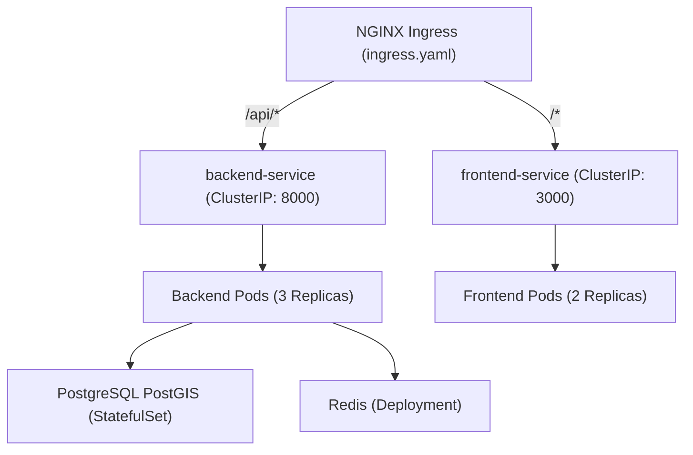

# DevOps, Containerization & Deployment Guide

This guide details how to build, deploy, scale, and maintain the **CASHGUARD-AI (CPAF)** system across local development, Docker Compose environments, and production Kubernetes clusters.

---

## 1. Containerization Architecture

The system is decoupled into isolated multi-stage container images:

### 1.1 Backend Dockerfile (`backend/Dockerfile`)
- **Base Image**: `python:3.11-slim`
- **System Dependencies**: `build-essential`, `libpq-dev`, `gdal-bin`, `libgdal-dev` (for PostGIS operations).
- **Security**: Creates an unprivileged user `appuser` (UID: `10001`) to run the Uvicorn server.
- **Port**: Exposes port `8000`.

### 1.2 Frontend Dockerfile (`frontend/Dockerfile`)
- **Base Image**: Multi-stage `node:18-alpine` (builder -> runner).
- **Next.js Standalone**: Configured for optimized minimal production container footprints.
- **Port**: Exposes port `3000`.

---

## 2. Docker Compose Deployment (`docker-compose.yml`)

The root `docker-compose.yml` provides a self-contained local deployment:

```yaml
version: "3.8"

services:
  postgres:
    image: postgis/postgis:15-3.3
    container_name: cpaf_postgres
    environment:
      POSTGRES_DB: ${POSTGRES_DB:-cpaf_db}
      POSTGRES_USER: ${POSTGRES_USER:-cpaf_user}
      POSTGRES_PASSWORD: ${POSTGRES_PASSWORD:-cpaf_pass}
    volumes:
      - postgres_data:/var/lib/postgresql/data
    ports:
      - "5432:5432"

  redis:
    image: redis:7-alpine
    container_name: cpaf_redis
    ports:
      - "6379:6379"

  backend:
    build:
      context: ./backend
      dockerfile: Dockerfile
    container_name: cpaf_backend
    ports:
      - "8000:8000"
    depends_on:
      postgres:
        condition: service_healthy
      redis:
        condition: service_healthy

  frontend:
    build:
      context: ./frontend
      dockerfile: Dockerfile
    container_name: cpaf_frontend
    ports:
      - "3000:3000"
    depends_on:
      - backend

  adminer:
    image: adminer
    container_name: cpaf_adminer
    ports:
      - "8080:8080"
```

### Launching Docker Compose:
```bash
# Clone and configure environment
cp .env.example .env

# Build and start all services
docker-compose up --build -d

# Verify container status
docker-compose ps
```

---

## 3. Production Kubernetes Manifests (`kubernetes/`)

Production deployments are orchestrated via native Kubernetes manifests:



### Manifest Files:
1. **`postgres-statefulset.yaml`**: Deploys PostGIS StatefulSet with persistent volume claims (`pvc-postgres`) and dedicated cluster service.
2. **`redis-deployment.yaml`**: Deploys Redis cache service.
3. **`backend-deployment.yaml`**: Deploys 3 replicas of the FastAPI application with liveness (`/health`) and readiness probes, resource requests/limits (`500m-1000m CPU`, `512Mi-1Gi RAM`).
4. **`frontend-deployment.yaml`**: Deploys Next.js frontend with rolling update strategy.
5. **`ingress.yaml`**: NGINX Ingress controller routing external traffic based on path rules.

### Deploying to Kubernetes:
```bash
# Apply ConfigMaps and Secrets first
kubectl create secret generic backend-secrets --from-env-file=.env

# Apply manifests
kubectl apply -f kubernetes/
```

---

## 4. Continuous Integration & Continuous Deployment (CI/CD)

The `.github/workflows/` directory contains automated GitHub Actions pipelines:

### 4.1 CI Pipeline (`.github/workflows/ci.yml`)
Triggers on pull requests and pushes to `main`:
- **Backend Job**: Lints with `flake8`, verifies typing, executes `pytest` suite against a PostgreSQL/Redis service container.
- **Frontend Job**: Runs ESLint, TypeScript type checking (`tsc --noEmit`), and builds Next.js production bundle.
- **Docker Build Job**: Validates that both backend and frontend Dockerfiles build successfully.

### 4.2 Automated Retraining Pipeline (`.github/workflows/retrain.yml`)
- **Schedule**: Executes automatically every Sunday at midnight (`cron: '0 0 * * 0'`) or manually via `workflow_dispatch`.
- **Steps**:
  1. Pulls latest complaint and withdrawal records from database.
  2. Runs `python backend/app/ml/train.py --production`.
  3. Evaluates validation accuracy metrics against threshold.
  4. Commits and releases new serialized model artifacts to model registry.
