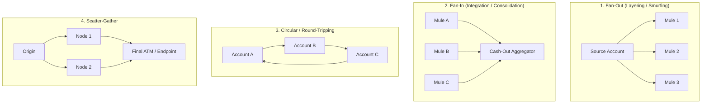
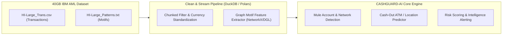

# IBM AML (Anti-Money Laundering) Dataset Integration & Preprocessing Guide

This document provides a comprehensive technical blueprint for integrating the **40 GB IBM Transactions for Anti-Money Laundering (AML)** dataset ([Kaggle Reference](https://www.kaggle.com/datasets/ealtman2019/ibm-transactions-for-anti-money-laundering-aml/data)) into the **CASHGUARD-AI (CPAF)** predictive intelligence platform.

---

## 1. Dataset Overview & Schema Analysis

The dataset is a massive synthetic banking network generated via multi-agent simulations, modeling realistic financial crime operations and money laundering topologies.

### 1.1 Dataset Breakdown & Variations
The ~40 GB dataset is divided into two primary categories across multiple volume tiers:
- **HI (High-Illicit Ratio)**: Higher concentration of laundering operations (e.g., `HI-Small`, `HI-Medium`, `HI-Large_Trans.csv`).
- **LI (Low-Illicit Ratio)**: Realistic real-world sparse distributions where laundering represents < 0.1% to 1% of transactions (e.g., `LI-Large_Trans.csv`).
- **Pattern Files (`*_Patterns.txt`)**: Ground-truth transaction graph motifs linking accounts into coordinated laundering rings.

### 1.2 Raw Column Schema

| Column Name | Data Type | Description | CASHGUARD-AI Mapping |
| :--- | :--- | :--- | :--- |
| `Timestamp` | DateTime (`YYYY/MM/DD hh:mm`) | Date & time of the transaction | Feeds `complaint_date` / `incident_date` & Prophet temporal models |
| `From Bank` | Integer / String Code | Originating financial institution | Maps to originating `bank_name` (e.g., SBI, HDFC) |
| `Account` | Alphanumeric (e.g., `8000E5280`) | Originating bank account ID | Source account / victim account |
| `To Bank` | Integer / String Code | Beneficiary financial institution | Intermediary mule bank or cash-out endpoint |
| `Account.1` | Alphanumeric (e.g., `8000E5280`) | Beneficiary bank account ID | Mule account / destination endpoint |
| `Amount Received` | Float | Transferred sum in receiving currency | Defrauded amount (`amount_defrauded`) |
| `Receiving Currency` | String (USD, EUR, etc.) | Currency of recipient account | Target currency (converted to INR standard) |
| `Amount Paid` | Float | Transferred sum in paying currency | Source amount deducted |
| `Payment Currency` | String (USD, EUR, etc.) | Currency of originating account | Originating currency |
| `Payment Format` | String (`ACH`, `Wire`, `Cash`, `Cheque`, `Credit Card`, `Reinvestment`) | Transaction transfer mechanism | Transaction channel / cash-out vector |
| `Is Laundering` | Binary Integer (`0` or `1`) | Ground-truth AML fraud indicator | Supervision label for classification & risk models |

---

## 2. Laundering Graph Motifs in the Dataset

The dataset explicitly models 8 distinct money laundering topologies in `*_Patterns.txt`:



1. **Fan-Out (Smurfing)**: Splitting large illicit proceeds into small sub-threshold amounts across multiple mule accounts.
2. **Fan-In (Consolidation)**: Funneling dispersed funds into a central account immediately prior to cash withdrawal.
3. **Scatter-Gather & Gather-Scatter**: Multi-hop complex layering across intermediate banks to obscure the audit trail.
4. **Cycles**: Circular fund movements between shell entities to simulate legitimate commercial volume.
5. **Stack & Bipartite**: Layered sequential transfers through multiple accounts of different banking tiers.

---

## 3. Role of the Dataset in CASHGUARD-AI



### 3.1 Enhancing the Cash-Out Location Predictor
In real-world cybercrime (vishing/phishing/card skimming), stolen money is rapidly moved through 2–4 mule accounts before physical ATM cash-outs. 
- By identifying **Fan-In** and **Scatter-Gather** terminals in the AML dataset, CASHGUARD-AI models can predict the **exact final hop bank branch or ATM kiosk** where the perpetrator will withdraw cash.

### 3.2 Advanced Risk Level Classification
- In addition to complaint text and stolen amount, the system can compute graph network metrics:
  - **In-Degree / Out-Degree Ratios**: Velocity of funds entering vs leaving an account.
  - **Cycle Participation Index**: High likelihood of organized fraud rings.
  - **Transfer Velocity**: Time delta between receiving funds and cash withdrawal.

### 3.3 Automated Intelligence & Fraud Ring Alerts (`/api/v1/intelligence`)
- Groups related complaints into **cross-jurisdictional syndicate clusters**, feeding real-time tactical alerts to law enforcement officers.

---

## 4. Large-Scale Data Cleaning & Preprocessing Pipeline

To process 40 GB of CSV data without exhausting system RAM, use **chunked stream processing** with **Polars**, **PyArrow**, or **DuckDB**.

### 4.1 Recommended Preprocessing Strategy
1. **Out-of-Core Processing**: Avoid `pd.read_csv()` on the entire 40GB file. Process in 500,000-row chunks or use DuckDB queries.
2. **Storage Format Optimization**: Convert raw CSVs into columnar, Snappy-compressed **Parquet** partitions (reduces 40 GB to ~6–8 GB).
3. **Node Unification**: Create unique composite account identifiers:
   $$\text{unique\_id} = \text{hash}(\text{Bank ID} + \text{"\_"} + \text{Account ID})$$
4. **Currency Normalization**: Convert all `Amount Paid` and `Amount Received` into standard currency (e.g., INR or USD).

---

## 5. Python Stream-Processing & Extraction Script

The following production-ready ETL script demonstrates how to clean, filter, and extract graph features from the IBM AML dataset in streaming chunks:

```python
"""
IBM AML Dataset Streaming & Feature Engineering Pipeline
Handles 40GB+ CSV data efficiently using chunked streaming.
"""

import pandas as pd
import numpy as np
import pyarrow.parquet as pq
import pyarrow as pa
import os

def clean_and_transform_aml_chunk(df: pd.DataFrame) -> pd.DataFrame:
    """
    Cleans raw IBM AML transaction chunk and extracts engineered features.
    """
    # 1. Rename columns to standardized snake_case
    rename_map = {
        'Timestamp': 'timestamp',
        'From Bank': 'from_bank',
        'Account': 'from_account',
        'To Bank': 'to_bank',
        'Account.1': 'to_account',
        'Amount Received': 'amount_received',
        'Receiving Currency': 'receiving_currency',
        'Amount Paid': 'amount_paid',
        'Payment Currency': 'payment_currency',
        'Payment Format': 'payment_format',
        'Is Laundering': 'is_laundering'
    }
    df = df.rename(columns=rename_map)

    # 2. Create globally unique account identifiers
    df['from_node'] = df['from_bank'].astype(str) + "_" + df['from_account'].astype(str)
    df['to_node'] = df['to_bank'].astype(str) + "_" + df['to_account'].astype(str)

    # 3. Parse timestamp & extract temporal features
    df['timestamp'] = pd.to_datetime(df['timestamp'], errors='coerce')
    df['hour'] = df['timestamp'].dt.hour
    df['day_of_week'] = df['timestamp'].dt.dayofweek
    df['is_weekend'] = df['day_of_week'].isin([5, 6]).astype(int)

    # 4. Financial features
    df['amount_log'] = np.log1p(df['amount_paid'])
    df['is_round_amount'] = (df['amount_paid'] % 1000 == 0).astype(int)

    # 5. Flag cash-out potential payment formats (Cash, Cheque, Wire)
    cashout_formats = ['Cash', 'Cheque', 'Wire']
    df['is_cashout_format'] = df['payment_format'].isin(cashout_formats).astype(int)

    # 6. Drop unneeded raw fields to minimize memory
    cols_to_keep = [
        'timestamp', 'from_node', 'to_node', 'from_bank', 'to_bank',
        'amount_paid', 'amount_log', 'payment_format', 'is_cashout_format',
        'hour', 'day_of_week', 'is_weekend', 'is_round_amount', 'is_laundering'
    ]
    return df[cols_to_keep]


def process_aml_dataset(input_csv_path: str, output_parquet_path: str, chunksize: int = 500_000):
    """
    Streams 40GB CSV in chunks and writes to a unified partitioned Parquet dataset.
    """
    print(f"Starting ETL stream on: {input_csv_path}")
    writer = None

    for i, chunk in enumerate(pd.read_csv(input_csv_path, chunksize=chunksize)):
        print(f"Processing chunk {i + 1} ({len(chunk)} rows)...")
        transformed = clean_and_transform_aml_chunk(chunk)
        
        # Convert to PyArrow Table
        table = pa.Table.from_pandas(transformed)
        
        # Initialize Parquet writer on first chunk
        if writer is None:
            writer = pq.ParquetWriter(output_parquet_path, table.schema, compression='snappy')
        
        writer.write_table(table)

    if writer:
        writer.close()
    print(f"ETL Complete! Cleaned dataset saved to: {output_parquet_path}")


if __name__ == '__main__':
    # Example invocation on remote server / storage mount
    # process_aml_dataset('/data/HI-Large_Trans.csv', '/data/processed_aml_large.parquet')
    pass
```

---

## 6. Integration Roadmap with CASHGUARD-AI

| Step | Objective | Target Component |
| :--- | :--- | :--- |
| **Phase 1: Subgraph Mining** | Extract high-density illicit transaction paths (`HI-Large_Patterns.txt`) where transactions terminate in cash withdrawals. | `backend/app/ml/` |
| **Phase 2: Graph Metric Enrichment** | Compute account-level graph centralities (PageRank, In/Out degree, Hub scores) and merge into the 17-feature matrix. | `backend/app/ml/feature_engineering.py` |
| **Phase 3: Mule Network Ingestion** | Ingest high-risk mule account nodes into PostgreSQL `withdrawal_locations` / `accounts` table. | `backend/app/models/` |
| **Phase 4: Multi-Hop Trail UI** | Render interactive graph money trails on the Next.js frontend using Leaflet / Cytoscape.js. | `frontend/src/components/dashboard/` |
