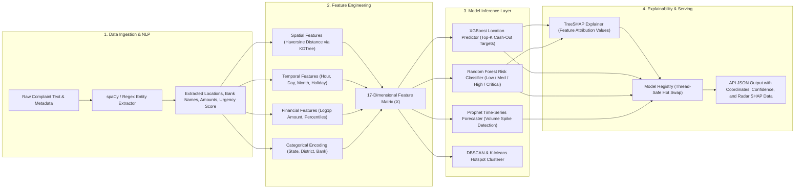

# Machine Learning Pipeline & Predictive Models

CASHGUARD-AI (CPAF) features a multi-tiered predictive AI pipeline engineered for geographic, temporal, and risk-based intelligence. It translates unstructured cybercrime reports and transactional data into actionable predictive insights.

---

## 1. Machine Learning Architecture Overview



---

## 2. Feature Engineering Pipeline (`app.ml.feature_engineering`)

The `FeatureEngineer` class extracts a standardized 17-dimensional feature vector `FEATURE_NAMES`:

| # | Feature Name | Type | Description |
|---|---|---|---|
| 1 | `hour` | Integer (0-23) | Hour of the day when the complaint/incident occurred. |
| 2 | `day_of_week` | Integer (0-6) | Day of the week (Monday=0, Sunday=6). |
| 3 | `month` | Integer (1-12) | Month of the incident. |
| 4 | `is_weekend` | Binary (0/1) | Whether incident occurred on Saturday or Sunday. |
| 5 | `is_holiday_period` | Binary (0/1) | Whether incident occurred during festive months (Oct/Nov). |
| 6 | `dist_to_city_center` | Float (km) | Haversine distance to nearest major metro center (Mumbai, Delhi, Bangalore, Hyderabad, Chennai, Kolkata). |
| 7 | `dist_to_atm` | Float (km) | Euclidean/Haversine distance to nearest known ATM via Scikit-Learn `KDTree`. |
| 8 | `tfidf_sum` | Float | Approximate lexical length / TF-IDF density factor. |
| 9 | `ner_loc_count` | Integer | Frequency of spatial prepositions and named location references. |
| 10 | `bank_name_indicator` | Binary (0/1) | Binary flag indicating if major Indian banks (SBI, HDFC, ICICI, Axis, PNB) are mentioned. |
| 11 | `amount_log` | Float | Natural logarithm of defrauded amount: $\log(1 + \text{amount})$. |
| 12 | `amount_percentile` | Float (0.0-1.0) | Relative rank percentile of the defrauded amount in historical distribution. |
| 13 | `is_round_number` | Binary (0/1) | Flag for round sums (multiples of 1000 INR), common in fraud operations. |
| 14 | `state_encoded` | Integer | Label-encoded state identifier. |
| 15 | `district_encoded` | Integer | Label-encoded district identifier. |
| 16 | `category_encoded` | Integer | Label-encoded crime category (`vishing`, `phishing`, `otp_fraud`, `atm_fraud`, `other`). |
| 17 | `bank_encoded` | Integer | Label-encoded financial institution. |

### Haversine Distance Calculation
Spatial distances are calculated using great-circle geometry on spherical Earth:
$$d = 2 R \arcsin \left( \sqrt{\sin^2\left(\frac{\Delta \text{lat}}{2}\right) + \cos(\text{lat}_1)\cos(\text{lat}_2)\sin^2\left(\frac{\Delta \text{lon}}{2}\right)} \right)$$
where $R = 6371.0 \text{ km}$.

---

## 3. Natural Language Processing Extractor (`app.ml.nlp_extractor`)

The `NLPExtractor` inspects free-text cybercrime descriptions:
- **Named Entity Recognition (NER)**: Loads spaCy's `en_core_web_sm` model to extract `GPE` (Geopolitical Entities) and `LOC` (Locations).
- **Financial Entity Parsing**: Regex pattern `(?:rs\.?|inr|₹)\s*([\d,]+(?:\.\d{1,2})?)` extracts stolen amounts.
- **Sentiment & Urgency Scoring**:
  - Computes sentiment polarity via `TextBlob`.
  - Checks for urgency trigger words (`urgent`, `threatening`, `blackmail`, `immediately`, `police`, `suicide`, `extortion`) to calculate an `urgency_score` between $0.0$ and $1.0$.

---

## 4. Machine Learning Models

### 4.1 Cash-Out Location Predictor (`app.ml.xgboost_model`)
- **Algorithm**: `xgboost.XGBClassifier` with `multi:softprob` objective.
- **Hyperparameters**:
  - `n_estimators`: 500
  - `max_depth`: 6
  - `learning_rate`: 0.05
  - `subsample`: 0.8
  - `eval_metric`: `mlogloss`
  - `early_stopping_rounds`: 20
- **Capabilities**:
  - `predict_top_k(X, k=5)`: Returns the top 5 highest-probability withdrawal zones or ATM nodes with individual confidence probabilities.
  - `get_feature_importance()`: Provides global feature attribution scores.

### 4.2 Risk Level Classifier (`app.ml.random_forest_model`)
- **Algorithm**: `sklearn.ensemble.RandomForestClassifier`.
- **Hyperparameters**:
  - `n_estimators`: 200
  - `class_weight`: `'balanced'` (handles class imbalances in fraud datasets)
  - `random_state`: 42
- **Output**: Risk classification (`low`, `medium`, `high`, `critical`) along with class probability distributions.

### 4.3 Temporal Forecaster (`app.ml.prophet_model`)
- **Algorithm**: Facebook Prophet with yearly, weekly, and daily seasonalities enabled.
- **Holiday Calibration**: Embedded with Indian country holiday calendars (`country_name='IN'`).
- **Forecasting Modes**:
  - Multi-day trend forecast (`forecast(periods=7)`): Predicts future crime volume spikes with confidence bounds (`yhat_lower`, `yhat_upper`).
  - 24-hour diurnal forecast (`forecast_by_hour(date)`): Identifies high-risk withdrawal time windows throughout a 24-hour cycle.

### 4.4 Hotspot Detector & Spatial Clustering (`app.ml.kmeans_hotspot`)
- **Algorithms**: Hybrid DBSCAN + K-Means clustering.
  1. **DBSCAN** (`eps=0.01`, `min_samples=5`): Filters spatial noise and detects arbitrary-shaped dense incident clusters.
  2. **K-Means**: Partitions cluster points into $k$ centroids (dynamically calculated: $k = \min(15, \text{len}(coords) - 1)$ capped at 5).
- **Cluster Attributes**: Calculates centroid coordinates (`center_lat`, `center_lng`), maximum cluster radius in kilometers, incident frequency, and normalized risk score ($\min(1.0, \text{incident\_count} / 100)$).

---

## 5. Model Explainability (`app.ml.shap_explainer`)

To maintain transparency for law enforcement decisions, CPAF integrates **SHAP (SHapley Additive exPlanations)**:
- Uses `shap.TreeExplainer` on tree-based models (XGBoost and Random Forest) to calculate Shapley values per instance.
- Translates instance-level explanations into radar-chart payloads for the frontend:
  ```json
  [
    {"feature": "amount_log", "value": 0.42},
    {"feature": "dist_to_city_center", "value": -0.18},
    {"feature": "bank_name_indicator", "value": 0.31}
  ]
  ```
- Generates global mean absolute SHAP values for ranking top crime drivers.

---

## 6. Dynamic Model Registry (`app.ml.model_registry`)

The `ModelRegistry` implements a **Thread-Safe Singleton** with re-entrant locks:
- Registers and stores in-memory model instances with semantic version tags.
- Provides `hot_swap(name, new_model, new_version)`: Enables zero-downtime model updates during production retraining cycles.
- Persists model artifacts to `app/ml/model_artifacts/` as serialized `.pkl` and Prophet `.json` files.

---

## 7. Model Training Pipeline (`app.ml.train`)

The training script `train.py` can be executed standalone or within GitHub Actions:

```bash
# Execute training pipeline
python backend/app/ml/train.py --from-csv /path/to/complaints.csv --model-version v1.2 --production
```

### Training Pipeline Steps:
1. Load dataset (from CSV or database query).
2. Fit `KDTree` on all registered ATM / kiosk coordinates.
3. Transform records into feature matrix $X$ and label vectors ($y_{\text{cluster}}$, $y_{\text{risk}}$).
4. Perform 80/20 train-test split.
5. Train and validate `XGBClassifier` and `RandomForestClassifier`.
6. Fit `Prophet` time-series forecaster on aggregated daily crime frequencies.
7. Run `HotspotDetector` on geographic coordinate distribution.
8. Register models in `ModelRegistry` and save serialized artifacts to disk.
