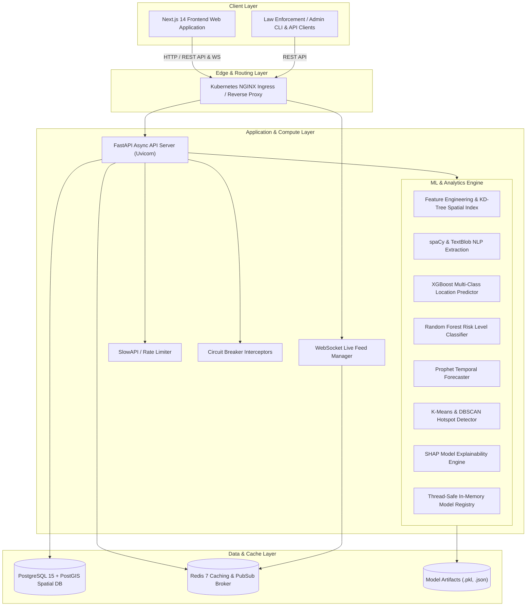
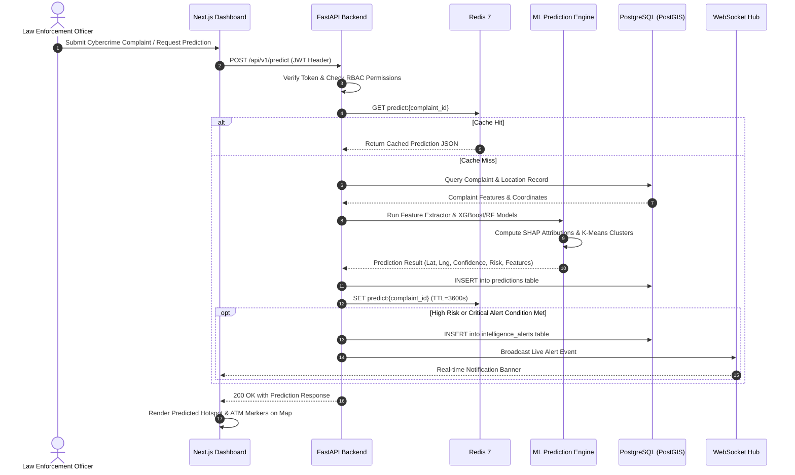

# System Architecture & Technical Design

## 1. High-Level System Architecture

The **Cybercrime Predictive Analytics Framework (CPAF)** / **CASHGUARD-AI** is designed as a modular, distributed, service-oriented system that ingests complaint data, applies Natural Language Processing (NLP) and geospatial feature engineering, runs predictive machine learning models, and serves real-time geospatial intelligence via an interactive Next.js dashboard and WebSocket live feeds.

---

## 2. Component Breakdown

### 2.1 Frontend Client (Next.js 14 / TypeScript)
- **Framework**: Next.js 14 (App Router) + React 18 + TypeScript.
- **Styling & Components**: Tailwind CSS, Radix UI primitives (`@radix-ui/*`), Lucide React icons.
- **Geospatial & Mapping**: Leaflet, `react-leaflet`, `leaflet.heat` for interactive heatmap layers, geofence radii, and ATM pin clustering.
- **Data Visualization**: Recharts for time series, radar diagrams (feature importance), and bar charts.
- **State Management**: Zustand (`useAppStore`), SWR for stale-while-revalidate client fetching.
- **Real-Time Communication**: Native WebSocket client connected to FastAPI WebSocket endpoint (`/api/v1/ws/live-feed`).

### 2.2 Backend Application (FastAPI / Python 3.11)
- **ASGI Web Server**: FastAPI running on Uvicorn workers.
- **Database Access**: SQLAlchemy 2.0 with `asyncpg` async PostgreSQL driver.
- **Data Validation & Serialisation**: Pydantic v2 schemas and `pydantic-settings`.
- **Security & RBAC**: JWT token authentication (`python-jose`), Passlib bcrypt password hashing, and role-based route guards (`admin`, `analyst`, `viewer`).
- **Resilience & Fault Tolerance**:
  - **SlowAPI**: IP-based rate limiting on endpoints (60 req/min default).
  - **Circuit Breaker**: In-memory state machine (`CLOSED` -> `OPEN` -> `HALF_OPEN`) to isolate downstream failures.
  - **Anonymizer**: PII masking on victim phone numbers, names, and bank account credentials.
  - **Structured Logging**: `structlog` with JSON formatting and contextual metadata.

### 2.3 Machine Learning Pipeline
The ML layer operates both **online** (inference during complaint creation/prediction requests) and **offline** (training via scheduled cron or CLI).
- **Feature Pipeline**: Haversine distance to city hubs and nearest ATMs (via KDTree), temporal encoding, log-transformed financial amounts, and categorical encodings.
- **Inference Engine**:
  - Predicts the highest-probability cash-out locations (ATMs / kiosks).
  - Classifies risk levels (`low`, `medium`, `high`, `critical`).
  - Forecasts temporal crime spikes using Facebook Prophet.
  - Clusters hotspots using DBSCAN and K-Means.
  - Explains individual predictions with SHAP feature attribution.
- **Model Registry**: Singleton pattern with thread-safe locking supporting dynamic hot-swapping of models without service downtime.

### 2.4 Data Persistence & Cache
- **PostgreSQL 15 + PostGIS**: Stores relational entities (`users`, `complaints`, `predictions`, `intelligence_alerts`, `withdrawal_locations`) with geospatial coordinates.
- **Redis 7**: Caches expensive ML prediction outputs (`predict:{complaint_id}` with 1-hour TTL) and manages active connection tokens and rates.

---

## 3. End-to-End Data & Request Flow

---

## 4. Security & Privacy Architecture

1. **Role-Based Access Control (RBAC)**:
   - `admin`: Full system control (user creation, deleting complaints, updating locations, deploying models).
   - `analyst`: Can create complaints, trigger predictions, acknowledge alerts, view full incident details.
   - `viewer`: Read-only access with automatic PII masking (names and phone numbers obfuscated to `***`).
2. **PII Masking & Anonymization Engine**:
   - `mask_phone`: Obfuscates all but the last 4 digits (e.g. `******4589`).
   - `mask_name`: Obfuscates names with initials (e.g. `V**** S*****`).
   - `mask_account`: Masks bank accounts (e.g. `********1234`).
3. **Container Security**:
   - Docker containers execute as non-root users (`uid=10001`).
   - Strict CORS configuration configurable via environment variables.
